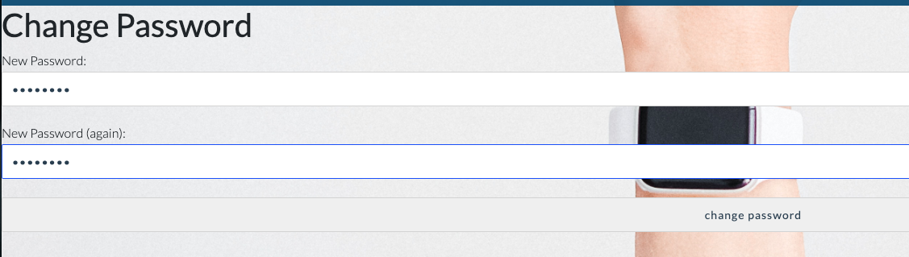

## Manual testing

## User Stories Testing

#### Viewing and Navigation

- As a shopper I want to be able to view a list of products (**READ**) so that I can some to purchase.

- As a shopper I want to be able to individual product details (**READ**) so that I can identify the price, description, product rating, image, check stock availability.

- As a shopper I want to be able to view the total of my purchases at any time (Shopping bag).

- As a shopper I want to be able to identify deals and special offers so that I can take advantage of special saving on products I am interested in.

**Note: This user story was not implemented in this initial release.**

### Registration and User Accounts (Authentication)

- As a Site User I want to be able to register for an account so that I can have a personal account and be able to view my profile.

- As a Site User I want to be able to login/logout for an account so that I can access my personal account details.

- As a Site User I want to be able to recover my password in case I forget it so that I can recover access to my account.

- As a Site User I want to be able to receive a confirmation email after registering so that I can verify that my account was successfully created.

- As a Site User I want to be to have a personalised user profile so that I can view my personal order history and order confirmations, and save my payment information.

- As a Site User I want to be able to register for an account so that I can have a personal account and be able to view my profile.

### Sorting and Searching (SQL operations)

- As a shopper I want to be able to sort the list of available products so that I can identify the best rated, best priced, and others (**ALL PRODUCTS**).

- As a shopper I want to be able to sort a specific category of products so that I can identify the best rated, best priced in that particular category (**FILTER PRODUCTS - WHERE**).

- As a shopper I want to be able to sort multiple categories of products simultaneously that I can identify the best rated, best priced in that particular group (**FILTER PRODUCTS - WHERE**).

**Note: This user story was not implemented in this initial release.**

- As a shopper I want to be able to search for a product by name or description so that I can find  a specific product I would like to purchase (**SEARCH**).

- As a shopper I want to be able to see what I have searched and the number of results (items) so that I can decide whether the product I want is available (**DISPLAY**).

### Purchasing and Checkout

- As a shopper I want to be able to select the quantity of a product so that I can ensure that I do not accidentally select the wrong product or quantity. (**QUANTITY BUTTON**).

- As a shopper I want to be able to view items I have added to my shopping bag so that I can identity the total cost of my purchase and all items I will receive (**SUMMARY TABLE**).

- As a shopper I want to be able to adjust details of a particular item I have in my shopping bag so that I can make changes before checkout. (**EDIT**)

**Note:** In this release shopper are allowd to delete item from cart. 

- As a shopper I want to be able to enter my payment information so that I can check out quickly. (**PAYMENT FUNCTIONALITY**)

- As a shopper I want to feel my personal data and payment is safe and secure so that I can trust my transaction. (**SECURE PAYMENT STATEMENTS**).

- As a shopper I want to receive a confirmation email after checkout so that I can keep record of my purchases.

### Purchasing and Checkout

- As a store owner I want to be able to add a new product so that I can add new item to my store (**ADD**).

- As a store owner I want to be able to Edit/Update a product so that I can change product prices, descriptions, images, and other criteria. (**EDIT/UPDATE**)

- As a store owner I want to be able to delete a product so that I can remove items that are not longer for sale. (**DELETE**) 

