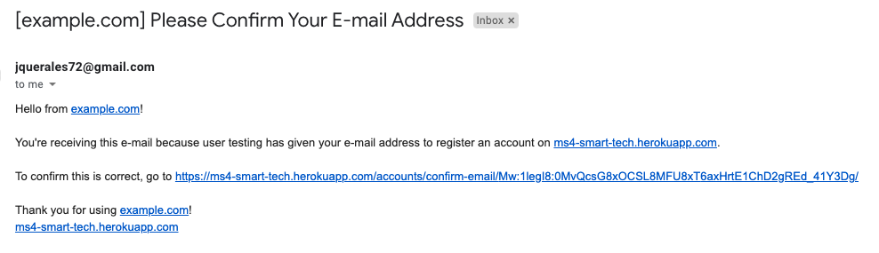
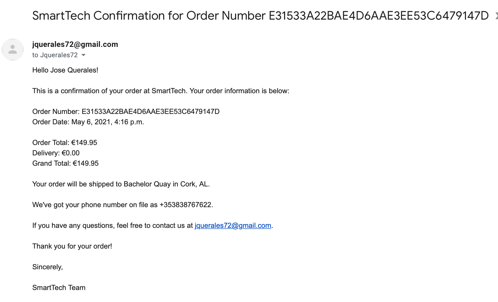

## Manual testing

## User Stories Testing

#### Viewing and Navigation

- As a shopper I want to be able to view a list of products (**READ**) so that I can some to purchase.

    - **Action**: I went to navegation bar and clicked on Catalog > All Products.
    - **Expected**: List of 61 products displayed on screen.
    - **Result**: Pass

- As a shopper I want to be able to individual product details (**READ**) so that I can identify the price, description, product rating, image, check stock availability.

    - **Action**: I clicked on a particular product.
    - **Expected**: Redirect to a new page with product details and add to cart/wishlist options.
    - **Result**: Pass

    

- As a shopper I want to be able to view the total of my purchases at any time (Shopping bag).

    - **Action**: I added product to cart.
    - **Expected**: shopping cart on navbar being updated and showing number of items and grand total.
    - **Result**: Pass

- As a shopper I want to be able to identify deals and special offers so that I can take advantage of special saving on products I am interested in.

    - **Action**:**Note: This user story was not implemented in this initial release.**

### Registration and User Accounts (Authentication)

- As a Site User I want to be able to register for an account so that I can have a personal account and be able to view my profile.

    - **Action**: I clicked on register button on navegation bar and completed form.
    - **Expected**: Redirect to new page confirming that email was sent.
    - **Result**: Pass

- As a Site User I want to be able to receive a confirmation email after registering so that I can verify that my account was successfully created.

    - **Action**: Checked my email inbox.
    - **Expected**: Confirmation email with verification link gotten.
    - **Result**: Pass

- As a Site User I want to be able to login/logout for an account so that I can access my personal account details.

    - **Action**: Click on Login button in navegation bar.
    - **Expected**: Redirected to new page with login form.
    - **Result**: Pass

- **Action**: Click on Logout button in navegation bar.
- **Expected**: Redirected to new page with logout confirmation.
- **Result**: Pass

- As a Site User I want to be able to recover my password in case I forget it so that I can recover access to my account.

    - **Action**: Click on Login button in navegation bar and then  click on Forgot my password button.
    - **Expected**: Redirected to new page with login form, email sent and change password link received.
    - **Result**: Pass

- As a Site User I want to be able to receive a confirmation email after registering so that I can verify that my account was successfully created.

    - **Action**: Signed Up for an account.
    - **Expected**: Received email confirmation email.
    - **Result**: Pass

- As a Site User I want to be to have a personalised user profile so that I can view my personal order history and order confirmations, and save my payment information.

    - **Action**: Once logged in I clicked on Profile link on navegation bar.
    - **Expected**: Redirected to new page with a profile dashboard containing delivery information, shopping history and wishlist.
    - **Result**: Pass

- As a Site User I want to be able to register for an account so that I can have a personal account and be able to view my profile.

    - **Action**: Once Register link on navegation bar.
    - **Expected**: Redirected to Signing in form.
    - **Result**: Pass

### Sorting and Searching (SQL operations)

- As a shopper I want to be able to sort the list of available products so that I can identify the best rated, best priced, and others (**ALL PRODUCTS**).

    - **Action**: Went to Catalog> All products page and clicked on Sort By button in it and selected available options.
    - **Expected**: Products being reorganized according to my sorting criteria.
    - **Result**: Pass

- As a shopper I want to be able to sort a specific category of products so that I can identify the best rated, best priced in that particular category (**FILTER PRODUCTS - WHERE**).

    - **Action**: Went to Catalog> All products page and clicked on Sort By button in it and selected available options.
    - **Expected**: Products being reorganized according to my sorting criteria.
    - **Result**: Pass

- As a shopper I want to be able to sort multiple categories of products simultaneously that I can identify the best rated, best priced in that particular group (**FILTER PRODUCTS - WHERE**).

 - **Note: This user story was not implemented in this initial release.**

- As a shopper I want to be able to search for a product by name or description so that I can find  a specific product I would like to purchase (**SEARCH**).

- As a shopper I want to be able to see what I have searched and the number of results (items) so that I can decide whether the product I want is available (**DISPLAY**).

    - **Action**: Went to navegation bar and search for "heart".
    - **Expected**: Products containing the word "heart" being displayed only.
    - **Result**: Pass

### Purchasing and Checkout

- As a shopper I want to be able to select the quantity of a product so that I can ensure that I do not accidentally select the wrong product or quantity. (**QUANTITY BUTTON**).

    - **Action**: Went to Catalog> All products page and clicked on a particular product and set the quantity using quantity button.
    - **Expected**: Redirect to product details page and quantity being update by clicking.
    - **Result**: Pass

- As a shopper I want to be able to view items I have added to my shopping bag so that I can identity the total cost of my purchase and all items I will receive (**SUMMARY TABLE**).

    - **Action**: Clicked on shooping cart on navegation bar.
    - **Expected**: Redirect to Shopping cart details page.
    - **Result**: Pass

- As a shopper I want to be able to adjust details of a particular item I have in my shopping bag so that I can make changes before checkout. (**EDIT**)

    - **Action**: Clicked on remove from cart icon in shopping cart summary.
    - **Expected**: Success message display & item removed from cart.
    - **Result**: Pass

- **Note:** In this release shopper are allowd to delete item from cart. 

- As a shopper I want to be able to enter my payment information so that I can check out quickly. (**PAYMENT FUNCTIONALITY**)

    - **Action**: Clicked on Checkout button in shopping cart summary page.
    - **Expected**: Redirect to checkout form and secure payment.
    - **Result**: Pass

- As a shopper I want to feel my personal data and payment is safe and secure so that I can trust my transaction. (**SECURE PAYMENT STATEMENTS**).

Icons for secure payments are displayed.

- As a shopper I want to receive a confirmation email after checkout so that I can keep record of my purchases.

### Purchasing and Checkout

- As a store owner I want to be able to add a new product so that I can add new item to my store (**ADD**).

    - **Action**: Complete order & payment and checked my email inbox.
    - **Expected**: Order Summary email received.
    - **Result**: Pass

All shop management are available through the admin provided by Django.

- As a store owner I want to be able to Edit/Update a product so that I can change product prices, descriptions, images, and other criteria. (**EDIT/UPDATE**)

- As a store owner I want to be able to delete a product so that I can remove items that are not longer for sale. (**DELETE**) 

## Stripe Payments Testing

I have testing different test card numbers provided by Stripe.

Card requesting further verification:

Card with insufficient funds:

