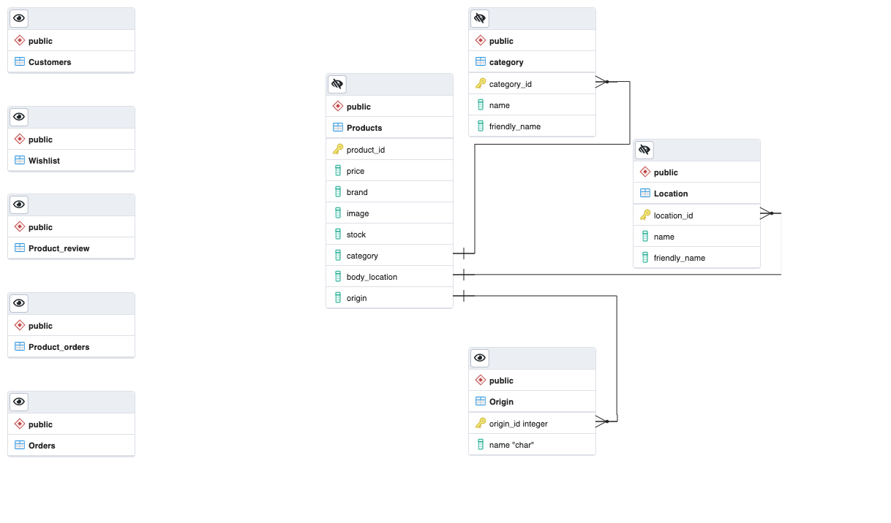

Work in progress!

## Continuous integration reports: 
[](https://www.travis-ci.com/jdquerales/MilestoneProject_4)  [](https://codecov.io/gh/jdquerales/MilestoneProject_4)

## Stream Fourth Project: Full Stack Frameworks with Django Development - Code Institute

This is the fourth milestone project of my journey as a Software Developer in Code Institute. The aim of this project is to 
build a full-stack site based around business logic used to control a centrally-owned dataset. I will set up an authentication
mechanism and provide paid access to the site's data and/or other activities based on the dataset, such as the purchase of 
a product/service.


## Table of Contents
1. [**UX**](#ux)
    - [**Project Goals**](#project-goals)
    - [**User Stories**](#user-stories)
    - [**Design**](#design)
    - [**Wireframes**](#wireframes)

2. [**Features**](#features)
    - [**Existing Features**](#existing-features)
    - [**Features Left to Implement**](#features-left-to-implement)
3. [**Information Architecture**](#information-architecture)
    - [**Database Choice**](#database-choice)
    - [**Data Modelling**](#data-modelling)

4. [**Technologies Used**](#technologies-used)
    - [**Languages**](#languages)
    - [**Libraries and Frameworks**](#libraries-and-frameworks)
    - [**Tools**](#tools)
    - [**Databases**](#databases)

5. [**Testing**](#testing)
6. [**Deployment**](#deployment)
    - [**Local Deployment**](#local-deployment)
    - [**Heroku Deployment**](#heroku-deployment)

7. [**Credits**](#credits)
    - [**Code**](#code)
    - [**Content and Media**](#content-and-media)
    - [**Acknowledgements**](#acknowledgements)
8. [**Disclaimer**](#disclaimer)


## Deployment
The SmartTeach project was developed using the [GitPod](https://www.gitpod.io/) online IDE and
using Git & GitHub for version control. It is hosted on the [Heroku](https://heroku.com/) platform, with static files on WhiteNoise and user-uploaded images being hosted in AWS S3 Basket.
### Local Deployment
To be able to run this project, the following tools have to be installed:
- An IDE of your choice (I used [GitPod](https://www.gitpod.io/) for creating this project)
- [Git](https://git-scm.com/)
- [PIP](https://pip.pypa.io/en/stable/installing/) 
- [Python3](https://www.python.org/download/releases/3.0/)    

Apart from that, you also need to create accounts with the following services:
- [Stripe](https://stripe.com/en-ie)
- [AWS](https://aws.amazon.com/) to setup the [S3 basket](https://docs.aws.amazon.com/AmazonS3/latest/gsg/CreatingABucket.html)
- [Gmail](https://mail.google.com/)

#### Directions
1. You can clone this repository directly into the editor of your choice by pasting the following command into the terminal:   
`git clone https://github.com/jdquerales/MilestoneProject_4`    
Alternatively, you can save a copy of this repository by clicking the green button **Clone or download** , then **Download Zip** button, and after extract the Zip file to your folder.      
In the terminal window of your local IDE change the directory (CD) to the correct file location (directory that you have just created).       

Note: You can read more information about the cloning process on the [GitHub Help page](https://docs.github.com/en/github/creating-cloning-and-archiving-repositories/cloning-a-repository).   

2. Set up environment variables.     
Note, that this process will be different depending on IDE you use.   
In this it was done using the following way:      
    - Create `.env` file in the root directory.
    - Add `.env` to the `.gitignore` file in your project's root directory
    - In `.env` file set environment variables with the following syntax:     
    ```bash 
    import os  
    os.environ["DEVELOPMENT"] = "True"    
    os.environ["SECRET_KEY"] = "<Your Secret key>"    
    os.environ["STRIPE_PUBLIC_KEY"] = "<Your Stripe Public key>"    
    os.environ["STRIPE_SECRET_KEY"] = "<Your Stripe Secret key>"    
    os.environ["STRIPE_WH_SECRET"] = "<Your Stripe WH_Secret key>"    
     ```
       
Read more about how to set up the Stripe keys in the [Stripe Documentation](https://stripe.com/docs/keys)
    
3. Install all requirements from the **requirements.txt** file putting this command into your terminal:     
`pip3 install -r requirements.txt`     
4. In the terminal in your IDE migrate the models to crete a database using the following commands:    
`python3 manage.py makemigrations`     
`python3 manage.py migrate`     
5. Load the data fixtures(**categories**, **products**, **itinerary**, **itinerary_items**, **events**) in that order into the database using the following command:    
`python3 manage.py loaddata <fixture_name>`        
6. Create a superuser to have an access to the the admin panel(you need to follow the instructions then and insert username,email and password):    
`python3 manage.py createsuperuser`   
7. You will now be able to run the application using the following command:     
`python3 manage.py runserver`     
8. To access the admin panel, you can add the `/admin` path at the end of the url link and login using your superuser credentials.

### Heroku Deployment
*To start Heroku Deployment process, you need to clone the project as described in the [Local deployment](#local-deployment) section above.*     
To deploy the project to [Heroku](https://heroku.com/) the following steps need to be completed:    
1. Create a **requirement.txt** file, which contains a list of the dependencies, using the following command in the terminal:    
`pip3 freeze > requirements.txt`    
2. Create a **Procfile**, in order to tell Heroku how to run the project, using the following command in the terminal:      
`web: gunicorn wearable_tech.wsgi:application`    
3. `git add`, `git commit` and `git push` these files to GitHub repository.     
NOTE: these 1-3 steps already done in this project and included in the GitHub repository, but illistrated here as they are required for the successfull deployment to Heroku.        
As well as that, other things that are required for the Heroku deployment and have to be installed: **gunicorn** (WSGI HTTP Server), **dj-database-url** for database connection and **Psycopg** (PostgreSQL driver for Python). All of the mentioned above are *already installed* in this project in the requirements.txt file.     
4. On the [Heroku](https://heroku.com/) website you need to create a **new app**, assigne a name (must be unique),set a region to the closest to you(for my project I set Europe) and click **Create app**.   
5. Go to **Resources** tab in Heroku, then in the **Add-ons** search bar look for **Heorku Postgres**(you can type `postgres`), select **Hobby Dev — Free** and click **Provision** button to add it to your project.     
6. In Heroku **Settings** click on **Reveal Config Vars**.   
7. Set the following config variables there:     

| KEY            | VALUE         |
|----------------|---------------|
| AWS_ACCESS_KEY_ID | `<your aws access key>`  |
| AWS_SECRET_ACCESS_KEY | `<your aws secret access key>`  |
| DATABASE_URL| `<your postgres database url>`  |
| EMAIL_HOST_PASS | `<your email password(generated by Gmail)>` |
| EMAIL_HOST_USER| `<your email address>`  |
| SECRET_KEY | `<your secret key>`  |
| STRIPE_PUBLIC_KEY| `<your stripe public key>`  |
| STRIPE_SECRET_KEY| `<your stripe secret key>`  |
| STRIPE_WH_SECRET| `<your stripe wh key>`  |
| USE_AWS | `True`  |

Note: More about Google Map key settings can be found [here](#google-maps-api-key-set-up).
     
8. Copy **DATABASE_URL's value**(Postgres database URL) from the Config Vars and temporary paste it into the default database in **settings.py**.     
You can temporary comment out the current database settings code and just paste the following in the settings.py:   
```bash 
  DATABASES = {     
        'default': dj_database_url.parse("<your Postrgres database URL here>")     
    }
  ```
Important Note: that's just temporary set up, this URL **should not be committed and published to GitHub** for security reasons, so make sure not to commit your changes to Git while the URL is in the settings.py.     
9. Migrate the database models to the Postgres database using the following commands in the terminal:    
`python3 manage.py makemigrations`     
`python3 manage.py migrate`     
10. Load the data fixtures(**categories**, **products**, **itinerary**, **itinerary_items**, **events**) into the  Postgres database using the following command:     
`python3 manage.py loaddata <fixture_name>`      
11. Create a **superuser** for the Postgres database by running the following command(*you need to follow the instructions and inserting username,email and password*):      
`python3 manage.py createsuperuser`     
12. You need to remove your Postgres URL database from the settings and uncomment the default DATABASE settings code in the settings.py file.    
Note: for production you get the environment variable 'DATABASE_URL' from the Heroku Config Vars and use Postgress database, while for development you use the SQLite as a default database.     
13. Add your Heroku app URL to **ALLOWED_HOSTS** in the settings.py file.
14. You can connect Heroku to GitHub to automatically deploy each time you push to GitHub.    
To do so, from the Heroku dashboard follow the steps:
-  **Deploy** section -> **Deployment method** -> select **GitHub**
-  link the Heroku app to your GitHub repository for this project
- click **Enable Automatic Deploys** in the Automatic Deployment section
- Run `git push` command in the terminal, that would now push your code to both Github and Heroku, and perform the deployment.     

Alternatively, in the terminal you can run:    
- `heroku login`    
-  after adding and comitting to Git, run the following command:     
`git push heroku master`
15. After successful deployment, you can view your app bu clicking **Open App** on Heroku platform.
16. You will also need to verify your email address, so you need to login with your superuser credentials and verify your email address in the admin panel. Now you will be able to view the app running!    
##### Hosting media files with AWS
The **static files** and **media files** (that will be uploaded by superuser - product/service images) are hosted in the [AWS S3 Bucket](https://aws.amazon.com/). To host them, you need to create an account in AWS and create your S3 basket with *public access*. More about setting it up you can read in [Amazon S3 documentation](https://docs.aws.amazon.com/AmazonS3/latest/gsg/CreatingABucket.html) and [this tutorial](https://django-storages.readthedocs.io/en/latest/backends/amazon-S3.html).
##### Sending email via Gmail
In order to send real emails from the application, you need to connect it to your **Gmail account**, setting up your **email address** in EMAIL_HOST_USER variable and your **app password** generated by your email provider in EMAIL_HOST_PASS variable.


<div align="right">
    <b><a href="#table-of-contents">↥ Back To Top</a></b>
</div>

---


## Data Model


