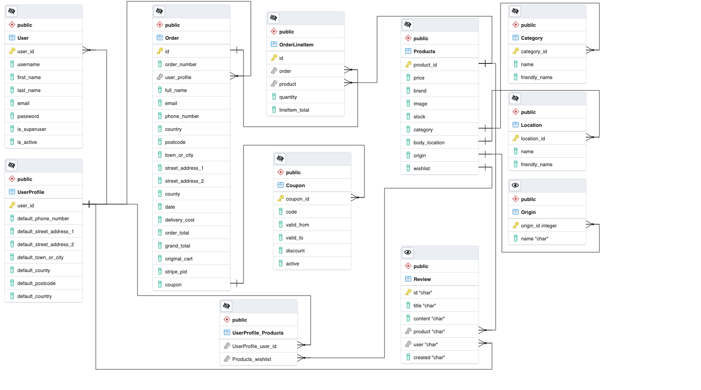

## Continuous integration status: 
[](https://www.travis-ci.com/jdquerales/MilestoneProject_4)  [](https://codecov.io/gh/jdquerales/MilestoneProject_4)

## Stream Fourth Project: Full Stack Frameworks with Django Development - Code Institute

## Live website

The deployed website can be found [here](https://ms4-smart-tech.herokuapp.com/).


## Table of Contents
1. [**UX**](#ux)
    - [**Project Goals**](#project-goals)
    - [**User Stories**](#user-stories)
    - [**Design**](#design)
    - [**Wireframes**](#wireframes)

2. [**Features**](#features)
    - [**Existing Features**](#existing-features)
    - [**Features Left to Implement**](#features-left-to-implement)
3. [**Information Architecture**](#information-architecture)
    - [**Database Choice**](#database-choice)
    - [**Data Modelling**](#data-modelling)

4. [**Technologies Used**](#technologies-used)
    - [**Languages**](#languages)
    - [**Libraries, Tools, Frameworks & APIs**](#libraries-and-frameworks)
    - [**Databases**](#databases)

5. [**Testing & Validation**](#testing)

6. [**Deployment**](#deployment)
    - [**Local Deployment**](#local-deployment)
    - [**Heroku Deployment**](#heroku-deployment)

7. [**Credits**](#credits)
    - [**Code**](#code)
    - [**Content and Media**](#content-and-media)
    - [**Acknowledgements**](#acknowledgements)
8. [**Disclaimer**](#disclaimer)

## UX

### Project Goals

This is the fourth milestone project of my journey as a Software Developer in Code Institute. The aim of this project is to  build a full-stack site based around business logic used to control a centrally-owned dataset. I will set up an authentication mechanism and provide paid access to the site's data and/or other activities based on the dataset, such as the purchase of a product/service.

In this project I will create a e-commerce application for a Smart Wearable Technologies shop. I will use the Wearable Technology Dataset from [Data.World](https://data.world/datasets/open-data). The dataset contains information on hundreds of wearables. It contains data on prices, company name and location, URLs for all wearables, as well as the location of the body on which the wearable in worn. 

The dataset contains columns such as: body_location, name, price, categories, image, company name (brand). I will use come of those columns to create my own database.

For example:

- **body_location**: Head, Wrist, Neck, Hands, Chest, Arms, Torso.
- **category**: Entertainment, Lifestyle, Fitness, Gaming, Medical.
- **company_country**: China, USA, UK, Japan, Canada, etc


The data model will contain at least the following models: product, category, body_location, users, shopping_bag, wishlist, product_reviews. 

The project will be divide into 5 main parts:
Viewing and Navigation
Registration and User Accounts
Sorting and searching
Purchasing and checkout
Admin and Store management.

As a proper e-commerce site it will target the following audience: Shopper, Site User, Store Owner. 

Each CRUD operation will be reflected correspondently to each target audience.


### User Stories


#### Viewing and Navigation

- As a shopper I want to be able to view a list of products (**READ**) so that I can some to purchase.

- As a shopper I want to be able to individual product details (**READ**) so that I can identify the price, description, product rating, image, check stock availability.

- As a shopper I want to be able to view the total of my purchases at any time (Shopping bag).

- As a shopper I want to be able to identify deals and special offers so that I can take advantage of special saving on products I am interested in.

### Registration and User Accounts (Authentication)

- As a Site User I want to be able to register for an account so that I can have a personal account and be able to view my profile.
- As a Site User I want to be able to login/logout for an account so that I can access my personal account details.
- As a Site User I want to be able to recover my password in case I forget it so that I can recover access to my account.
- As a Site User I want to be able to receive a confirmation email after registering so that I can verify that my account was successfully created.
- As a Site User I want to be to have a personalised user profile so that I can view my personal order history and order confirmations, and save my payment information.
- As a Site User I want to be able to register for an account so that I can have a personal account and be able to view my profile.

### Sorting and Searching (SQL operations)

- As a shopper I want to be able to sort the list of available products so that I can identify the best rated, best priced, and others (**ALL PRODUCTS**).
- As a shopper I want to be able to sort a specific category of products so that I can identify the best rated, best priced in that particular category (**FILTER PRODUCTS - WHERE**).

- As a shopper I want to be able to sort multiple categories of products simultaneously that I can identify the best rated, best priced in that particular group (**FILTER PRODUCTS - WHERE**).
- As a shopper I want to be able to search for a product by name or description so that I can find  a specific product I would like to purchase (**SEARCH**).
- As a shopper I want to be able to see what I have searched and the number of results (items) so that I can decide whether the product I want is available (**DISPLAY**).

### Purchasing and Checkout

- As a shopper I want to be able to select the quantity of a product so that I can ensure that I do not accidentally select the wrong product or quantity. (**QUANTITY BUTTON**).
- As a shopper I want to be able to view items I have added to my shopping bag so that I can identity the total cost of my purchase and all items I will receive (**SUMMARY TABLE**).
- As a shopper I want to be able to adjust details of a particular item I have in my shopping bag so that I can make changes before checkout. (**EDIT**)
- As a shopper I want to be able to enter my payment information so that I can check out quickly. (**PAYMENT FUNCTIONALITY**)
- As a shopper I want to feel my personal data and payment is safe and secure so that I can trust my transaction. (**SECURE PAYMENT STATEMENTS**).
- As a shopper I want to receive a confirmation email after checkout so that I can keep record of my purchases.


### Purchasing and Checkout

- As a store owner I want to be able to add a new product so that I can add new item to my store (**ADD**).
- As a store owner I want to be able to Edit/Update a product so that I can change product prices, descriptions, images, and other criteria. (**EDIT/UPDATE**)
- As a store owner I want to be able to delete a product so that I can remove items that are not longer for sale. (**DELETE**) 


### Design

#### Framework
- [Bootstrap](https://www.bootstrapcdn.com/), front-end framework is chosen for this project for its modern interface, ease of use and ability to be easily customized. It is used for creating features such as navbar, cards, forms, modals, as well as for the layout.

- [JQuery](https://jquery.com/) is used for initializing some Bootstrap components, as well as for custom functions, DOM manipulation.

#### Colour Scheme
One of the main goals in UI was to focus user's attention on the products/services images, while prioritazing information. Throughout  the site I have used the following colors palette:
 


#### Typography
There is one font used across the project: 
- [Lato Google Font](https://fonts.google.com/specimen/Lato) used as the main body font, popular modern sans-serif typeface providing good readability.

#### Icons   
- I used [FontAwesome](https://fontawesome.com/) as the main icon library across the project (e.g. for social media links, forms, cart, search and user icons in navigation).


### Wireframes


I used **Balsamiq** software to create my initial wireframes, starting 
with the mobile and desktop design as an overall idea and helping me 
to make the design responsive afterwards.
The deployed application slightly differs from the initial
wireframes as some of the features were evolving as I was working on the development.

[Desktop wireframe](/static/assets/wireframes/MS4_desktop.pdf)

[Mobile/Tablet wireframe](/static/assets/wireframes/MS4_mobile_tablet.pdf)


## Features

## Features
SmartTech website is composed by eight applications: `home`, `products`, `cart`, `reviews`, `wishlist`, `coupons`, `checkout`, `profiles`.


## Features Left to Implement

1. Authentication features using social accounts like Facebook, Twitter, Goggle+.
2. Store owner view for management (for the current release, product management can be donde only using the **admin** interface provided by Django).
3. Include product reviews.
4. Add subscription for newsletters.
5. Contact form.
6. Add clearance/offer categories in navegation bar.

### Features left to implement


## Testing & Validation

## Automatic testing during development

During the entire development of this project a adopted a Test Driven Development approach, as represented in the following diagram:


That approach helped me identify problems in early stages of development and to develop inmmediate solutions for failures in the code. I wrote about 50 testing units covering tests for models, views and forms. Tests file can be found in **apps**  levels directories prefixed by **tests_<model, views, forms>**. To run all tests go the project level command line interface and run the following command:

`coverage run manage.py test`  

If everything goes correctly, you should get the following message on the terminal:


Additionally, I have implemented continuous development tools using  [Travis CI](https://www.travis-ci.com/) and [Codecov](https://about.codecov.io/). After every commit, continuous development badges at the beginning of this document are updated, indicating whether tests passed or failed and the percentage of code being covered by unit tests.

As for the moment of writing this documentation [Codecov](https://about.codecov.io/) generated the following report:


## Manual testing of the deployed product

As it can be noted above, 73% of the project is covered by unit tests. Therefore, I have complemented the testing of the website, both in development and as a finished product has been done through **manual testing**.  Due to the extension of the testing procedures,  I have decided to present the manual tests conducted in a separated
file [Manual Tests](/ManualTesting/testing.md).


## Code validation

I used **W3C** to check my HTML and CSS files. I used **JSHint** validator to check my Javascript files. I used **PEP8online** to validate Python files.
Below screenshots of the validation results are exhibited.

## HMTL & CSS validation 
All html pages passed the **W3C** validator. A selection of validation outputs is shown as follows. A complete selection of screenshots for every html page can be found at [HTML validation](/static/assets/code_validation/)

HTML validation:


HTML validation:


## Python code validation:
During development I used the command line interface in Gitpod to detect problems
with Python code standard conventions (PEP8).


## Responsive design

The deployed application is fully responsive. I tested 
my site on Safari, Firefox, Opera and Google Chrome. The
mobile and desktop version of the website looks very good
 and it is working as planned.

I used the chrome DevTools to test that the website is fully responsive. I have also used my own Desktop/Laptop and mobile phone.
I tested the following devices (mobile and tablet sizes):

- Moto G4.

- Galaxy S5.

- Galaxy S9 (my own device).

- iPhone 5/SE, iPhone 6/7/8, iPhone 6/7/8 Plus and  iPhone X.

- iPad and iPad Pro.

- Surface Duo.

I also used **Am I Responsive?** to check my responsive design and to create 
the final product screenshots presented at the beginning.

## Deployment
The SmartTeach project was developed using the [GitPod](https://www.gitpod.io/) online IDE and
using Git & GitHub for version control. It is hosted on the [Heroku](https://heroku.com/) platform, with static files on WhiteNoise and user-uploaded images being hosted in AWS S3 Basket.
### Local Deployment
To be able to run this project, the following tools have to be installed:
- An IDE of your choice (I used [GitPod](https://www.gitpod.io/) for creating this project)
- [Git](https://git-scm.com/)
- [PIP](https://pip.pypa.io/en/stable/installing/) 
- [Python3](https://www.python.org/download/releases/3.0/)    

Apart from that, you also need to create accounts with the following services:
- [Stripe](https://stripe.com/en-ie)
- [AWS](https://aws.amazon.com/) to setup the [S3 basket](https://docs.aws.amazon.com/AmazonS3/latest/gsg/CreatingABucket.html)
- [Gmail](https://mail.google.com/)

#### Directions
1. You can clone this repository directly into the editor of your choice by pasting the following command into the terminal:   
`git clone https://github.com/jdquerales/MilestoneProject_4`    
Alternatively, you can save a copy of this repository by clicking the green button **Clone or download** , then **Download Zip** button, and after extract the Zip file to your folder.      
In the terminal window of your local IDE change the directory (CD) to the correct file location (directory that you have just created).       

Note: You can read more information about the cloning process on the [GitHub Help page](https://docs.github.com/en/github/creating-cloning-and-archiving-repositories/cloning-a-repository).   

2. Set up environment variables.     
Note, that this process will be different depending on IDE you use.   
In this it was done using the following way:      
    - Create `.env` file in the root directory.
    - Add `.env` to the `.gitignore` file in your project's root directory
    - In `.env` file set environment variables with the following syntax:     
    ```bash 
    import os  
    os.environ["DEVELOPMENT"] = "True"    
    os.environ["SECRET_KEY"] = "<Your Secret key>"    
    os.environ["STRIPE_PUBLIC_KEY"] = "<Your Stripe Public key>"    
    os.environ["STRIPE_SECRET_KEY"] = "<Your Stripe Secret key>"    
    os.environ["STRIPE_WH_SECRET"] = "<Your Stripe WH_Secret key>"    
     ```
       
Read more about how to set up the Stripe keys in the [Stripe Documentation](https://stripe.com/docs/keys)
    
3. Install all requirements from the **requirements.txt** file putting this command into your terminal:     
`pip3 install -r requirements.txt`     
4. In the terminal in your IDE migrate the models to crete a database using the following commands:    
`python3 manage.py makemigrations`     
`python3 manage.py migrate`     
5. Load the data fixtures(**categories**, **products**, **itinerary**, **itinerary_items**, **events**) in that order into the database using the following command:    
`python3 manage.py loaddata <fixture_name>`        
6. Create a superuser to have an access to the the admin panel(you need to follow the instructions then and insert username,email and password):    
`python3 manage.py createsuperuser`   
7. You will now be able to run the application using the following command:     
`python3 manage.py runserver`     
8. To access the admin panel, you can add the `/admin` path at the end of the url link and login using your superuser credentials.

### Heroku Deployment
*To start Heroku Deployment process, you need to clone the project as described in the [Local deployment](#local-deployment) section above.*     
To deploy the project to [Heroku](https://heroku.com/) the following steps need to be completed:    
1. Create a **requirement.txt** file, which contains a list of the dependencies, using the following command in the terminal:    
`pip3 freeze > requirements.txt`    
2. Create a **Procfile**, in order to tell Heroku how to run the project, using the following command in the terminal:      
`web: gunicorn wearable_tech.wsgi:application`    
3. `git add`, `git commit` and `git push` these files to GitHub repository.     
NOTE: these 1-3 steps already done in this project and included in the GitHub repository, but illistrated here as they are required for the successfull deployment to Heroku.        
As well as that, other things that are required for the Heroku deployment and have to be installed: **gunicorn** (WSGI HTTP Server), **dj-database-url** for database connection and **Psycopg** (PostgreSQL driver for Python). All of the mentioned above are *already installed* in this project in the requirements.txt file.     
4. On the [Heroku](https://heroku.com/) website you need to create a **new app**, assigne a name (must be unique),set a region to the closest to you(for my project I set Europe) and click **Create app**.   
5. Go to **Resources** tab in Heroku, then in the **Add-ons** search bar look for **Heroku Postgres**(you can type `postgres`), select **Hobby Dev — Free** and click **Provision** button to add it to your project.     
6. In Heroku **Settings** click on **Reveal Config Vars**.   
7. Set the following config variables there:     

| KEY            | VALUE         |
|----------------|---------------|
| AWS_ACCESS_KEY_ID | `<your aws access key>`  |
| AWS_SECRET_ACCESS_KEY | `<your aws secret access key>`  |
| DATABASE_URL| `<your postgres database url>`  |
| EMAIL_HOST_PASS | `<your email password(generated by Gmail)>` |
| EMAIL_HOST_USER| `<your email address>`  |
| SECRET_KEY | `<your secret key>`  |
| STRIPE_PUBLIC_KEY| `<your stripe public key>`  |
| STRIPE_SECRET_KEY| `<your stripe secret key>`  |
| STRIPE_WH_SECRET| `<your stripe wh key>`  |
| USE_AWS | `True`  |

Note: More about Google Map key settings can be found [here](#google-maps-api-key-set-up).
     
8. Copy **DATABASE_URL's value**(Postgres database URL) from the Config Vars and temporary paste it into the default database in **settings.py**.     
You can temporary comment out the current database settings code and just paste the following in the settings.py:   
```bash 
  DATABASES = {     
        'default': dj_database_url.parse("<your Postgres database URL here>")     
    }
  ```
Important Note: that's just temporary set up, this URL **should not be committed and published to GitHub** for security reasons, so make sure not to commit your changes to Git while the URL is in the settings.py.     
9. Migrate the database models to the Postgres database using the following commands in the terminal:    
`python3 manage.py makemigrations`     
`python3 manage.py migrate`     
10. Load the data fixtures(**categories**, **products**, **itinerary**, **itinerary_items**, **events**) into the  Postgres database using the following command:     
`python3 manage.py loaddata <fixture_name>`      
11. Create a **superuser** for the Postgres database by running the following command(*you need to follow the instructions and inserting username,email and password*):      
`python3 manage.py createsuperuser`     
12. You need to remove your Postgres URL database from the settings and uncomment the default DATABASE settings code in the settings.py file.    
Note: for production you get the environment variable 'DATABASE_URL' from the Heroku Config Vars and use Postgress database, while for development you use the SQLite as a default database.     
13. Add your Heroku app URL to **ALLOWED_HOSTS** in the settings.py file.
14. You can connect Heroku to GitHub to automatically deploy each time you push to GitHub.    
To do so, from the Heroku dashboard follow the steps:
-  **Deploy** section -> **Deployment method** -> select **GitHub**
-  link the Heroku app to your GitHub repository for this project
- click **Enable Automatic Deploys** in the Automatic Deployment section
- Run `git push` command in the terminal, that would now push your code to both Github and Heroku, and perform the deployment.     

Alternatively, in the terminal you can run:    
- `heroku login`    
-  after adding and comitting to Git, run the following command:     
`git push heroku master`
15. After successful deployment, you can view your app bu clicking **Open App** on Heroku platform.
16. You will also need to verify your email address, so you need to login with your superuser credentials and verify your email address in the admin panel. Now you will be able to view the app running!    
##### Hosting media files with AWS
The **static files** and **media files** (that will be uploaded by superuser - product/service images) are hosted in the [AWS S3 Bucket](https://aws.amazon.com/). To host them, you need to create an account in AWS and create your S3 basket with *public access*. More about setting it up you can read in [Amazon S3 documentation](https://docs.aws.amazon.com/AmazonS3/latest/gsg/CreatingABucket.html) and [this tutorial](https://django-storages.readthedocs.io/en/latest/backends/amazon-S3.html).
##### Sending email via Gmail
In order to send real emails from the application, you need to connect it to your **Gmail account**, setting up your **email address** in EMAIL_HOST_USER variable and your **app password** generated by your email provider in EMAIL_HOST_PASS variable.


<div align="right">
    <b><a href="#table-of-contents">↥ Back To Top</a></b>
</div>

---


## Information Architecture

### Data Modelling

I will adopt a OLTP (Online Transaction Processing) approach for the modelling of data in my project:

- Purpose: Support daily transactions.
- Design: Application-based.
- Data: Up-to-date, operational.
- Queries: Simple transactions & frequent updates.

Keeping in mind that the main challenge in data modeling is balancing the needs
of the application, the performance characteristics of the database engine, 
and the data retrieval patterns, I adopted the the philosophy that
while designing my data model I would consider the application usage of the data
(i.e. queries, updates, and processing of the data) as well as the inherent 
structure of the data itself.

I will adopt a logical-schema design approach. The data model schema was created by using the Entity-Relationship Diagram (ERD) tool provided by the [PGAdmin](https://www.pgadmin.org/docs/pgadmin4/development/erd_tool.html).




<div align="right">
    <b><a href="#table-of-contents">↥ Back To Top</a></b>
</div>

The database used in this project contains a total of 11 tables, which has been created using Django models. Different models can be found at the project level path: **<app_name>/models.py**. In the following I will describe each model grouped by app name:

#### Profile App
##### Profile
| **Name** | **Database Key** | **Field Type** | **Validation** |
--- | --- | --- | --- 
 User | user | OneToOneField 'User' |  primary_key=True, on_delete=models.CASCADE
 Phone number | default_phone_number | CharField | max_length=20, null=True, blank=True
 Street Addres 1 | default_street_address1 | CharField | max_length=80, null=True, blank=True
 Street Addres 2 | default_street_address1 | CharField | max_length=80, null=True, blank=True
 Town or City | default_town_or_city | CharField | max_length=40, null=True, blank=True
 County | default_county | CharField | max_length=80, null=True, blank=True
 Postcode | default_postcode | CharField | max_length=20, null=True, blank=True
 Country | default_country | CountryField | blank_label='Country', null=True, blank=True

#### Product App
##### Product

| **Name** | **Database Key** | **Field Type** | **Validation** |
--- | --- | --- | --- 
 Description | description | TextField |  
 Name | friendly_name | CharField | max_length=254
 Price | default_street_address1 | DecimalField | max_digits=6, decimal_places=2
 Category | category  | ForeignKey('Category') | null=True, blank=True, on_delete=models.SET_NULL
 Body Location | body_location| ForeignKey('Location') | null=True, blank=True, on_delete=models.SET_NULL
 Brand | brand | CharField | max_length=254, null=True, blank=True
 Origin | origin | ForeignKey('Origin') | null=True, blank=True, on_delete=models.SET_NULL
 Image | image | ImageField | null=True, blank=True
 Stock | stock | BooleanField | blank_label='Country', null=True, blank=True
 Users Wishlist | user_wishlist | ManyToManyField 'User' | related_name="user_wishlist", blank=True

##### Location 

| **Name** | **Database Key** | **Field Type** | **Validation** |
--- | --- | --- | --- 
 Description | description | TextField |  
 Name | name | CharField | max_length=254
 Friendly Name | friendly_name  | max_length=254, null=True, blank=True
 
##### Origin

| **Name** | **Database Key** | **Field Type** | **Validation** |
--- | --- | --- | --- 
 Description | description | TextField |  
 Name | name | CharField | max_length=254
 Friendly Name | friendly_name  | max_length=254, null=True, blank=True

##### 

Due to the **ManyToManyField** relationship between **User** and **Product** tables through the **user_wishlist** field,
Django automatically generates a linked table (name **UserProfile_Products**) in the ER diagram abow.

##### UserProfile_Products

| **Name** | **Database Key** | **Field Type** | **Validation** |
--- | --- | --- | --- 
 UserProfile_user_id| UserProfile_user_id |  |  
 Products_wishlist |  Products_wishlist |  |  


##### Category

| **Name** | **Database Key** | **Field Type** | **Validation** |
--- | --- | --- | --- 
 Description | description | TextField |  
 Name | name | CharField | max_length=254
 Friendly Name | friendly_name  | max_length=254, null=True, blank=True


#### Review App
##### Review
| **Name** | **Database Key** | **Field Type** | **Validation** |
--- | --- | --- | --- 
 Title | title | CharField |  max_length=30
 Content | content | TextField | 
 User | user | ForeignKey('UserProfile') | on_delete=models.CASCADE, related_name='comments', related_query_name='comment'
 Created | created | DateField | max_length=80, null=True, blank=True
 Rating | rating | IntegerField | choices=RATING_CHOICES, default=5

#### Coupon App
##### Coupon
| **Name** | **Database Key** | **Field Type** | **Validation** |
--- | --- | --- | --- 
 Code | title | CharField |  max_length=50, unique=True
 Valid From | valid_from | DateTimeField  | 
 Valid To | valid_to | DateTimeField | on_delete=models.CASCADE, related_name='comments', related_query_name='comment'
 Discount | created | IntegerField | validators=[MinValueValidator(0), MaxValueValidator(100)])
 Active | active | BooleanField | 

#### Profile App
##### Profile
| **Name** | **Database Key** | **Field Type** | **Validation** |
--- | --- | --- | --- 
 User | user | OneToOneField 'User' |  primary_key=True, on_delete=models.CASCADE
 Phone number | default_phone_number | CharField | max_length=20, null=True, blank=True
 Street Addres 1 | default_street_address1 | CharField | max_length=80, null=True, blank=True
 Street Addres 2 | default_street_address1 | CharField | max_length=80, null=True, blank=True
 Town or City | default_town_or_city | CharField | max_length=40, null=True, blank=True
 County | default_county | CharField | max_length=80, null=True, blank=True
 Postcode | default_postcode | CharField | max_length=20, null=True, blank=True
 Country | default_country | CountryField | blank_label='Country', null=True, blank=True


 #### Checkout App
##### Order
| **Name** | **Database Key** | **Field Type** | **Validation** |
--- | --- | --- | --- 
Order Number | order_number | CharField | max_length=32, null=False, editable=False
Profile | user_profile | ForeignKey 'UserProfile' | on_delete=models.SET_NULL, null=True, blank=True, related_name='orders'
Full Name | full_name | CharField | max_length=50, null=False, blank=False
Email | email | EmailField | max_length=254, null=False, blank=False
Phone number | phone_number | CharField | max_length=20, null=False, blank=False
Address Line1 | address_line1 | CharField | max_length=80, null=False, blank=False
Address Line2 | address_line2 | CharField | max_length=80, null=False, blank=False
Town/City | town_or_city | CharField | max_length=40, null=False, blank=False
County | county | CharField | max_length=50, null=True, blank=True
Postcode | postcode | CharField | max_length=20, null=True, blank=True
Country | country | CountryField | blank_label='Country*', null=False, blank=False
Purchase Date | date | DateTimeField | auto_now_add=True
Delivery Cost | delivery_cost | DecimalField | max_digits=6, decimal_places=2, null=False, default=0
Order Total | order_total | DecimalField | max_digits=10, decimal_places=2, null=False, default=0
Grand Total | grand_total | DecimalField | max_digits=10, decimal_places=2, null=False, default=0
Original Cart | original_cart | TextField | null=False, blank=False, default=''
Stripe Pid | stripe_pid | CharField | max_length=254, null=False, blank=False, default=''
Comment | comment | TextField | max_length=254, null=True, blank=True


##### Order Line Item
| **Name** | **Database Key** | **Field Type** | **Validation** |
--- | --- | --- | --- 
Order | order | ForeignKey 'Order' | null=False, blank=False, on_delete=models.CASCADE, related_name='lineitems'
Product | product | ForeignKey 'Product' | null=False, blank=False, on_delete=models.CASCADE
Quantity | quantity | IntegerField | null=False, blank=False, default=0
Item Total | lineitem_total | DecimalField | max_digits=6, decimal_places=2, null=False, blank=False, editable=False


## Technologies Used

### Languages

- [HTML5](https://developer.mozilla.org/en-US/docs/Web/HTML)
    - The project uses **HTML** as building block.
- [CSS3](https://www.w3.org/Style/CSS/Overview.en.html)
    - The project uses **Cascading Style Sheets (CSS)** for adding style to the website.
- [JS](https://developer.mozilla.org/en-US/docs/Web/JavaScript)
    - The project uses **JavaScript (JS)** for adding interactivity to the website.
- [Python](https://www.python.org/)
    -  The project uses **Python3** for adding developing the backend functionality of this project.
- [Jinja](https://jinja.palletsprojects.com/en/2.11.x/)
    - I used **Jinja2** as the HTML templating language for Python.


### Libraries, Tools, Frameworks & APIs

- [Bootstrap (5)](https://getbootstrap.com/)
    - The project uses **Bootstrap** to design and customize responsive mobile-first sites.
- [JQuery (3.5.1)](https://jquery.com/)
    - This project uses **JQuery** JavaScript library, to manupulate 
    the HTML document (DOM API) and add interactivity in a much simpler way. 
- [Balsamiq](https://balsamiq.com/wireframes/)
    - The project uses **Balsamiq** as wireframing tool.
- [Chrome DevTools](https://developers.google.com/web/tools/chrome-devtools/)
    - I use **Chrome DevTools** to inspect and test styling and responsive desing during my development process.
- [W3C](https://validator.w3.org)
    - I use **W3C** to check the HTML and CSS files.
- [JSHint](https://jshint.com/)
    - I use **JSHint** to check the JS files.
- [PEP8](http://pep8online.com/)
    - I use **PEP8 online** to check and validate the Python script files.
- [AmIResponsive](http://ami.responsivedesign.is)
    - I use **Am I Responsive?** to check my responsive design and take screenshots of the deployed website.
- [Fontawesome](https://fontawesome.com)
    - This project uses **FontAwesome** for including vector icons and social logos.
- [GoogleFonts](https://fonts.google.com)
    - This project uses **GoogleFonts** to import the font styles.
- [GitHub](https://github.com)
    - I used **GitHub** as my project repository.
- [GitPod](https://www.gitpod.io)
    - I used **GitPod** as the cloud-based development environment to write my code.
- [Heroku](https://www.heroku.com)
    - I used **Heroku** to deploy my project.
- [Django (3.1.7)](https://www.djangoproject.com/)
    - Django is a high-level Python Web framework that encourages rapid development and clean, pragmatic design. Built by experienced developers, it takes care of much of the hassle of Web development, so you can focus on writing your app without needing to reinvent the wheel. It’s free and open source.
- [Stripe (2.56.0)](https://stripe.com/ie)
    - I implemented online payments using Stripe API.
- [Travis CI](https://www.travis-ci.com/)
    - I implemented continuous integration features using Travis CI.
- [Codecov](https://about.codecov.io/)
    - Codecov provides highly integrated tools to group, merge, archive and compare coverage reports
- [AWS Simple Cloud Storage (S3)](https://aws.amazon.com/) 
    - To store static and media files in production.

### Databases
- [SQlite3](https://www.sqlite.org/index.html) 
    - I used SQlite3 as development database.
- [PostgreSQL](https://www.postgresql.org/) 
    - I used SQlite3 as production database hosted in Heroku.


<div align="right">
    <b><a href="#table-of-contents">↥ Back To Top</a></b>
</div>

## Credits
### Code
- The project's code was developed by following the [Code Institute](https://codeinstitute.net/) video lessons and based on the understanding of the Boutique Ado Django Mini-Project, but was customized, modified and enhanced to fit the project purposes. Checkout app and profiles apps  heavily rely on Code Institute Boutique ADO mini-project.
- I also constantly referred to the following documentation sources during the development: [Django](https://docs.djangoproject.com/en/3.2/), [Stripe](https://stripe.com/docs).
- During development of this project I extensively consulted the books "**Django 3 by example**" by Antonio Melé and "**Django for beginners**" by William S. Vincent.
### Content and Media
- Landing page background was taken from [Pexels](https://www.pexels.com/).
- Products content and images are taken from [data.world wearable technology database] (https://data.world/crowdflower/wearable-technology-database).

### Acknowledgements
I would like to thank everyone who has helped me throughout the development of this project:      
- My mentors Dick Vlaanderen and Guido Cecilio Garcia-Bernal (who joined the party for the last 2 sessions) for their support and helpful suggestions..
- Many thanks to my fellow students, **Slack community** and, of course, **my friends** and **my family** for the time, patience, help and support!         

<div align="right">
    <b><a href="#table-of-contents">↥ Back To Top</a></b>
</div>

---

## Disclaimer
This site is made for **educational purposes** only.        


<div align="right">
    <b><a href="#table-of-contents">↥ Back To Top</a></b>
</div>
